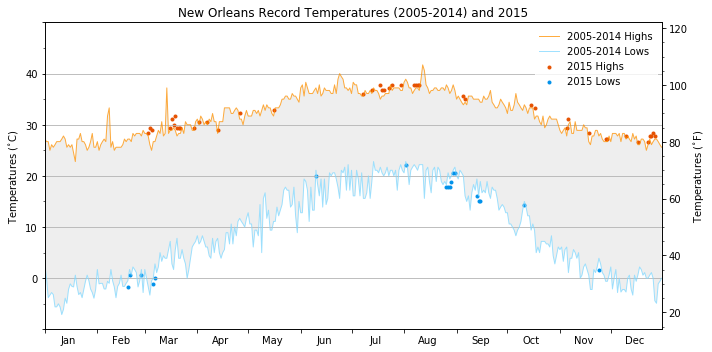

# Plotting temperatures using `matplotlib`
In the notebook, the highest and lowest temperatures for New Orleans is extracted for each day of the year over the 
period 2005-2014 using `pandas`. These highs and lows are plotted as line graphs using `matplotlib` and then record breaking temperatures for the year 2015 are scattered in the same graph. Both the Celsius and Fahrenheit scales are included as the left and right y-axis respectively; the month labels are centrally placed between the ticks denoting the start and end of each month in the x-axis. The verbal description in terms of legends, labels and title is minimalist, and every aspect of the graph, including the color palette, is thoughtfully chosen to convey the information visually. The effort is to make the graph look neat, accurate, informative and visually appealing. 

The data used can be found at [The National Centers for Environmental Information (NCEI) Daily Global Historical Climatology Network (GHCN-Daily)](https://www1.ncdc.noaa.gov/pub/data/ghcn/daily/readme.txt) and it contains daily climate records coming from the 12 stations near New Orleans over the period from Jan 01, 2005 to Dec 31, 2015.

[Here](http://www.aashitak.com/articles/Plotting-Temperatures-NOLA) is a blog on this.
